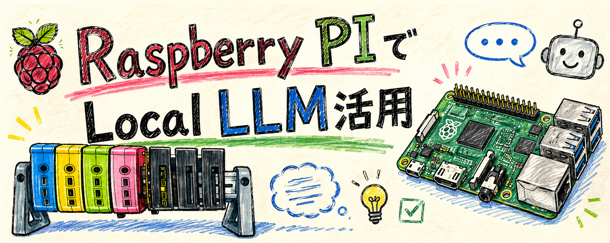
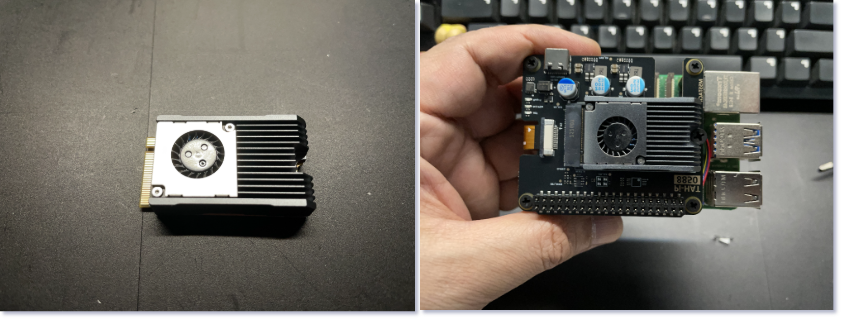

- Raspberry pi5 + llm8850(NPU) でローカルLLMを動かしてエッジAIとして活用。

## LLM8850 NPUとは？
LLM-8850 は、Raspberry Pi 5 に接続して利用する **ローカルAI推論用のAIアクセラレータカード** です。
中核には **Axera AX8850** というAI専用SoCが搭載されており、大規模言語モデル（LLM）や画像認識AIを、クラウドを使わずにエッジデバイス上で実行できます

| 項目   | 内容                           |
| ---- | ---------------------------- |
| AI性能 | 24 TOPS (INT8)               |
| SoC  | Axera AX8850                 |
| CPU  | Cortex-A55 ×8 (1.7GHz)       |
| メモリ  | LPDDR4x 8GB                  |
| 接続   | PCIe 2.0 x2 (M.2 M-Key 2242) |
| 対応機器 | Raspberry Pi 5、RK3588、x86 PC |
| 消費電力 | 約7W                          |
| 冷却   | ファン + アルミヒートシンク内蔵            |

- あくまでもエッジAI用NPU(8G)なので、LLMは小規模モデル2B〜４B。
- Axeraモデルとしてコンパイルしないと利用できない。（ AxeraモデルとしてGithubに用意されているもの推奨）

## LOCAL LLM HISTORY
[ローカルLLM　HISTORY](./docs/history.png)

## HOME LABのアプリケーションにLLMを組み込む
- そもそもLLMとは？
  - []
- Intent制御とスロット抽出をLLMの自然言語でコントロールする。
  - [アプリケーションLLMアーキテクチャ](./docs/logic.png)
- MVPのゴール
  - [MVP実装概要](./docs/mvp.png)

- Qwen3-1.7Bの性能
  

